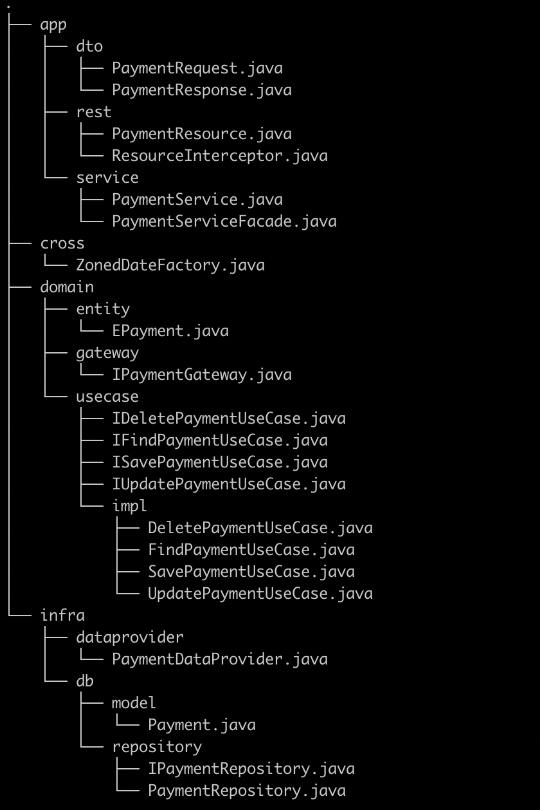

# ${artifact} Project

This project uses Quarkus, the Supersonic Subatomic Java Framework.

If you want to learn more about Quarkus, please visit its website: https://quarkus.io/ .

## Before the run

You need to run the following command to give permission to execute script mvnw
```
chmod 0755 mvnw
```

## Running the application in dev mode

You can run your application in dev mode which enables live coding using:
```shell script
./mvnw compile quarkus:dev
```

> **_NOTE:_**  Quarkus now ships with a Dev UI, which is available in dev mode only at http://localhost:8080/q/dev/.

## Packaging and running the application

The application can be packaged using:
```shell script
./mvnw package
```
It produces the `quarkus-run.jar` file in the `target/quarkus-app/` directory.
Be aware that it’s not an _über-jar_ as the dependencies are copied into the `target/quarkus-app/lib/` directory.

The application is now runnable using `java -jar target/quarkus-app/quarkus-run.jar`.

If you want to build an _über-jar_, execute the following command:
```shell script
./mvnw package -Dquarkus.package.type=uber-jar
```

The application, packaged as an _über-jar_, is now runnable using `java -jar target/*-runner.jar`.

## Creating a native executable

You can create a native executable using: 
```shell script
./mvnw package -Pnative
```

Or, if you don't have GraalVM installed, you can run the native executable build in a container using: 
```shell script
./mvnw package -Pnative -Dquarkus.native.container-build=true
```

You can then execute your native executable with: `./target/code-with-quarkus-1.0.0-SNAPSHOT-runner`

If you want to learn more about building native executables, please consult https://quarkus.io/guides/maven-tooling.

## CRUD Application

This Application is divided into some packages, to provide a pretty understood about 
how to build applications with Clean Architecture concepts.

Each Package has its responsibilities, which will explain below the image:



### App
    TODO:

### Cross
    TODO:

### Domain
    TODO:

### Infra -> DB
    TODO:
    
## Postgres Container

### Execute the Docker Compose to Up the Database example

Access the directory of Docker Compose

```shell script
  cd $path_project/src/main/docker-compose
```

Run the Docker Compose command to Up the container
```shell script
  docker-compose -f postgres.yml up
```
